<p align="center">
  
</p>

<h1 align="center">🍔 ChillBurger</h1>

<p align="center">
  <strong>A full-featured e-commerce web application for a gourmet burger restaurant</strong>
</p>

<p align="center">
  <a href="https://opensource.org/licenses/MIT"></a>
  
  
  
  
  
</p>

<p align="center">
  <a href="#-features">Features</a> •
  <a href="#-tech-stack">Tech Stack</a> •
  <a href="#-architecture">Architecture</a> •
  <a href="#-project-structure">Project Structure</a> •
  <a href="#-getting-started">Getting Started</a> •
  <a href="#-screenshots">Screenshots</a> •
  <a href="#-license">License</a>
</p>

---

## 📖 About

**ChillBurger** is a dynamic, full-stack e-commerce web application designed for a gourmet burger restaurant. It provides a complete online ordering experience — from browsing the menu and customizing burgers with individual ingredients, to managing a shopping cart, placing orders, and leaving reviews. The platform also includes a dedicated **manager dashboard** for inventory management, order tracking, and real-time notifications.

> **University Project** — Developed as part of the *Web Technologies* course (A.Y. 2024/2025) at the [University of Bologna](https://www.unibo.it/).

> **Bachelor Degree in [Computer Science and Engineering](https://corsi.unibo.it/laurea/IngegneriaScienzeInformatiche)**.


Built as an academic project at the **University of Bologna**, ChillBurger demonstrates modern web development practices with a clean MVC-inspired architecture, responsive design, and a rich RESTful API layer.

*😎 **Small Flex:** We received the highest possible score from the professors. 😎*

---

## ✨ Features

### 👤 Customer Experience
- 🍔 **Interactive Menu** — Browse the full burger catalog with detailed ingredient lists
- 🛠️ **Burger Customization** — Add, remove, or modify ingredients on any burger to create your perfect meal
- 🛒 **Shopping Cart** — Add both stock products and custom creations, manage quantities
- 💳 **Checkout & Payment** — Seamless checkout flow with order confirmation
- 📦 **Order Tracking** — Real-time order status updates with state history
- 🔔 **Notifications** — Get notified when your order status changes
- ⭐ **Reviews** — Rate and review past orders with paginated display
- 👤 **User Profile** — View order history and manage account details

### 🔧 Manager Dashboard
- 📊 **Order Management** — View, filter, and update order statuses in real-time
- 📋 **Menu Management** — Add, edit, or remove burgers and their compositions
- 🧾 **Ingredient Management** — Create new ingredients with images and surcharge pricing
- 📦 **Stock Control** — Monitor ingredient & product inventory with low-stock alerts
- 🔔 **Low-Stock Notifications** — Automatic alerts when inventory drops below threshold
- 🔍 **Order Detail View** — Full breakdown of each order including customizations

### 🌐 General
- 📱 **Fully Responsive** — Optimized for both desktop and mobile with adaptive navigation
- 🔐 **Authentication** — Secure login & registration with role-based access (Customer / Manager)
- 🎨 **Modern UI** — Clean design with Google Fonts (Nunito), Font Awesome icons, and smooth animations

---

## 🛠️ Tech Stack

| Layer           | Technology                                                                                           |
|:----------------|:-----------------------------------------------------------------------------------------------------|
| **Frontend**    | HTML5, CSS3, JavaScript (ES6+), [Bootstrap 5.3](https://getbootstrap.com/)                           |
| **Backend**     | [PHP 8.x](https://www.php.net/) with MVC-inspired template rendering                                |
| **Database**    | [MySQL 8.0](https://www.mysql.com/) via MySQLi prepared statements                                  |
| **Server**      | [XAMPP](https://www.apachefriends.org/) (Apache + MySQL)                                             |
| **Icons**       | [Font Awesome 6.4](https://fontawesome.com/)                                                         |
| **Typography**  | [Google Fonts — Nunito](https://fonts.google.com/specimen/Nunito), Leckerli One (custom)             |
| **Design**      | Mobile-first responsive design with dedicated desktop/mobile layouts                                 |

---

## 🏗️ Architecture

The application follows an **MVC-inspired architecture** with clear separation of concerns:

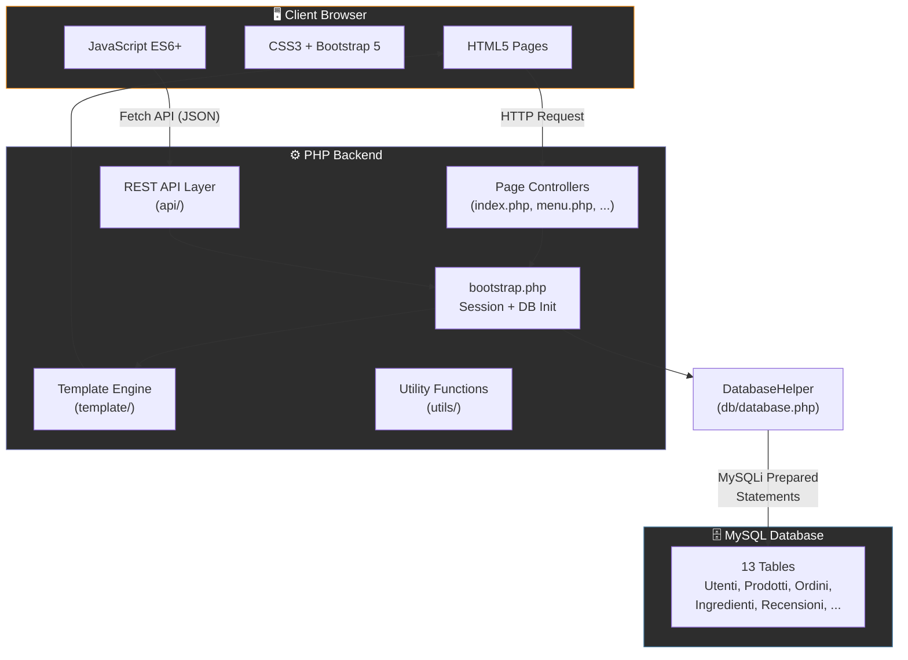

### 🔄 Request Flow

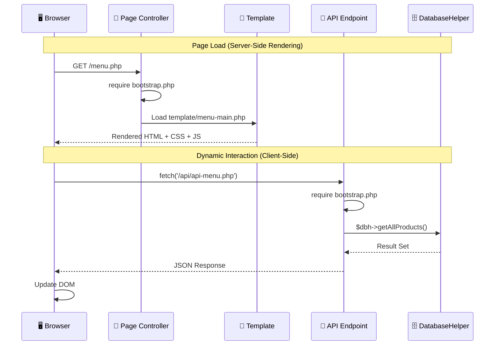

---

## 📁 Project Structure

```
ChillBurgerWebProject/
├── 📄 README.md                        # Project documentation
├── 📄 LICENSE                          # MIT License
├── 📄 ReportWeb.pdf                    # Academic project report
├── 📂 mockup/                          # UI design mockups
│   ├── 📂 dekstop/                     # Desktop wireframes
│   └── 📂 mobile/                      # Mobile wireframes
│
└── 📂 chillburger/                     # 🔥 Main application
    ├── 📄 index.php                    # Homepage entry point
    ├── 📄 bootstrap.php                # Session init & DB connection
    ├── 📄 login.php                    # Authentication handler
    ├── 📄 menu.php                     # Menu page
    ├── 📄 cart.php                     # Shopping cart
    ├── 📄 checkout.php                 # Checkout & payment
    ├── 📄 order_now.php                # Order placement
    ├── 📄 profile.php                  # User profile
    ├── 📄 reviews.php                  # Customer reviews
    ├── 📄 about_us.php                 # About us page
    ├── 📄 notifications.php            # User notifications
    ├── 📄 burger-details.php           # Burger detail view
    ├── 📄 edit-burger.php              # Burger customization
    ├── 📄 manager.php                  # Manager dashboard
    ├── 📄 manager_*.php                # Manager sub-pages
    │
    ├── 📂 api/                         # 🔌 RESTful API endpoints
    │   ├── api-login.php               # Authentication API
    │   ├── api-menu.php                # Menu data API
    │   ├── api-cart.php                # Cart operations API
    │   ├── api-orders.php              # Order management API
    │   ├── api-reviews.php             # Reviews API
    │   ├── api-profile.php             # Profile API
    │   ├── api-notifications.php       # Notifications API
    │   ├── api-burger-details.php      # Burger details API
    │   ├── api-edit-burger.php         # Burger editing API
    │   ├── api-manager-*.php           # Manager API endpoints
    │   └── api-order-now.php           # Order placement API
    │
    ├── 📂 template/                    # 🎨 PHP view templates
    │   ├── base.php                    # Master layout (header/footer/nav)
    │   ├── homepage.php                # Homepage template
    │   ├── login-form.php              # Login/register form
    │   ├── menu-main.php               # Menu listing
    │   ├── cart-view.php               # Cart display
    │   ├── payment.php                 # Payment form
    │   ├── profile-orders.php          # Order history
    │   ├── manager_*.php               # Manager templates
    │   └── access_denied.php           # 403 error page
    │
    ├── 📂 db/                          # 🗄️ Database layer
    │   ├── database.php                # DatabaseHelper class (67KB, full DAL)
    │   ├── ChillBurger.ddl             # Schema definition (DDL)
    │   ├── chillburgerdbcreation.sql   # Database creation script
    │   ├── DbPopulation.sql            # Sample data seed
    │   └── ChillBurger.lun             # DB-MAIN model file
    │
    ├── 📂 js/                          # ⚡ Client-side JavaScript
    │   ├── 📂 shared/                  # Shared modules
    │   │   ├── components.js           # Reusable UI components
    │   │   ├── utils.js                # Utility functions
    │   │   └── animation-dot.js        # Notification dot animation
    │   ├── menu.js                     # Menu page logic
    │   ├── cart.js                     # Cart interactions
    │   ├── checkout.js                 # Checkout flow
    │   ├── login.js                    # Auth form handling
    │   ├── edit-burger.js              # Burger customization UI
    │   ├── manager*.js                 # Manager dashboard logic
    │   └── ...                         # Additional page scripts
    │
    ├── 📂 css/                         # 🎨 Stylesheets
    │   ├── style.css                   # Global styles
    │   ├── menu_style.css              # Menu-specific styles
    │   ├── manager_style.css           # Manager dashboard styles
    │   ├── order_now_style.css         # Order page styles
    │   └── ...                         # Additional stylesheets
    │
    ├── 📂 resources/                   # 🖼️ Static assets
    │   ├── ChillBurgerLogo.webp        # Logo (desktop)
    │   ├── ChillBurgerLogoMobile.webp  # Logo (mobile)
    │   ├── ChillBurgerHomePage3.webp   # Hero image
    │   ├── 📂 carousel/               # Homepage carousel images
    │   ├── 📂 menu/                    # Menu category images
    │   ├── 📂 products/               # Product photos
    │   └── 📂 ingredients/            # Ingredient photos
    │
    ├── 📂 fonts/                       # ✏️ Custom fonts
    │   └── LeckerliOne-Regular.ttf     # Leckerli One typeface
    │
    └── 📂 utils/                       # 🔧 PHP utilities
        └── functions.php               # Session & auth helpers
```

---

## 🗃️ Database Schema

The application uses a **relational MySQL database** with **13 interconnected tables**:

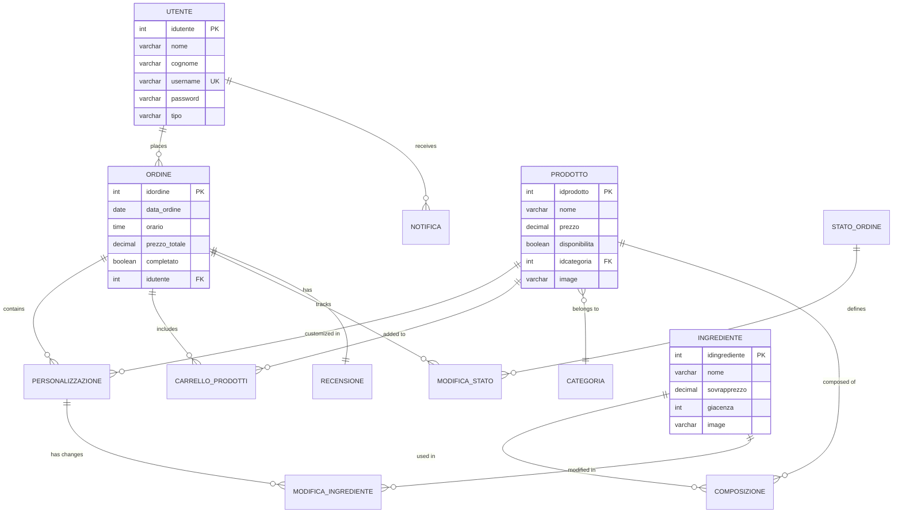

---

## 🚀 Getting Started

### Prerequisites

| Requirement  | Version |
|:-------------|:--------|
| 🖥️ XAMPP     | 8.x+    |
| 🐘 PHP       | 8.0+    |
| 🗄️ MySQL     | 8.0+    |
| 🌐 Browser   | Modern  |

### Installation

1. **Clone the repository** into your XAMPP `htdocs` directory:
   ```bash
   cd /Applications/XAMPP/xamppfiles/htdocs  # macOS
   # cd C:\xampp\htdocs                       # Windows
   git clone https://github.com/Filoferro03/ChillBurgerWebProject.git
   ```

2. **Start XAMPP** services:
   - Launch **Apache** and **MySQL** from the XAMPP Control Panel

3. **Create the database**:
   - Open [phpMyAdmin](http://localhost/phpmyadmin)
   - Import `chillburger/db/chillburgerdbcreation.sql` to create the schema
   - Import `chillburger/db/DbPopulation.sql` to seed sample data

4. **Configure the database connection** (if needed):
   - Edit `chillburger/bootstrap.php` and update the connection parameters:
     ```php
     $dbh = new DatabaseHelper("localhost", "root", "", "chillburgerdb", 3306);
     ```

5. **Access the application**:
   ```
   http://localhost/ChillBurgerWebProject/chillburger/
   ```

---

## 📸 Screenshots

<details>
<summary><strong>🖥️ Desktop Views</strong> (click to expand)</summary>
<br/>

| Homepage | Menu | Order Now |
|:--------:|:----:|:---------:|
| 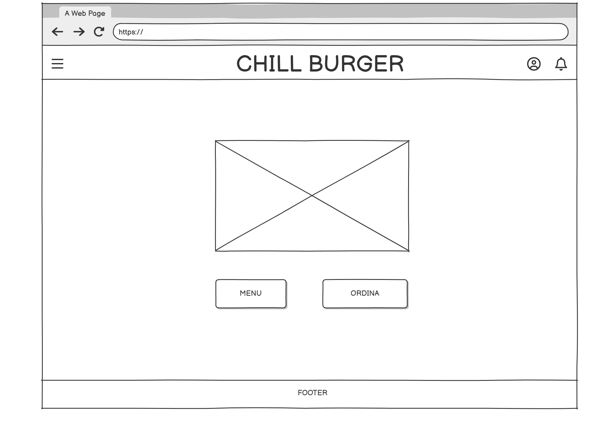 | 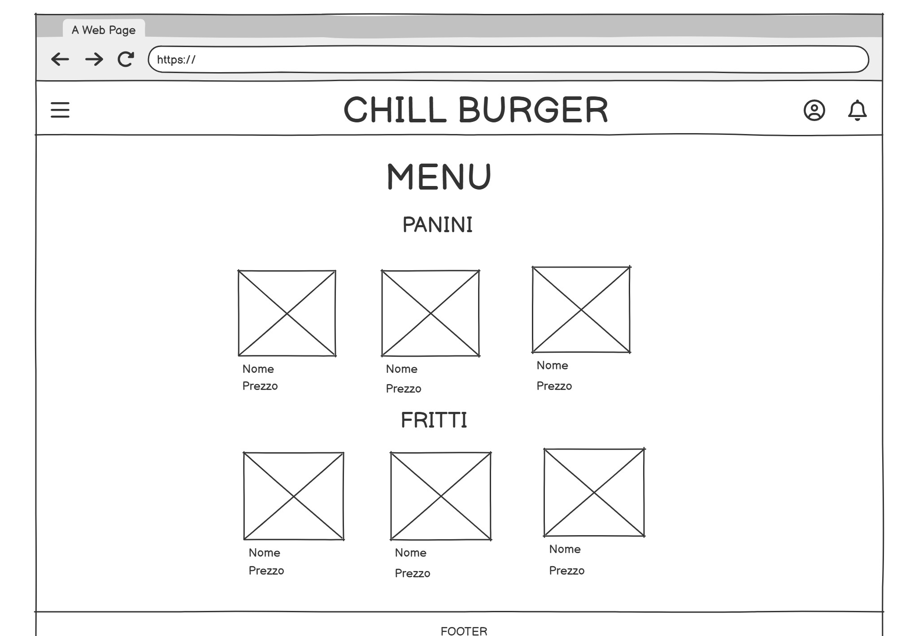 | 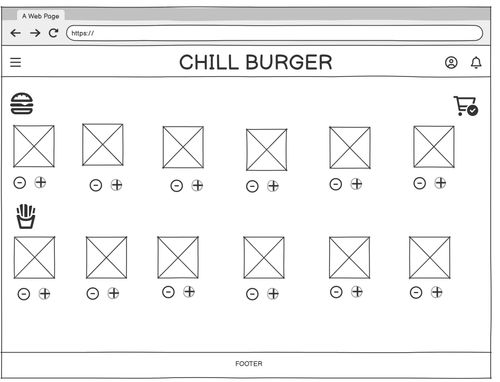 |

| Login | Profile | Reviews |
|:-----:|:-------:|:-------:|
| 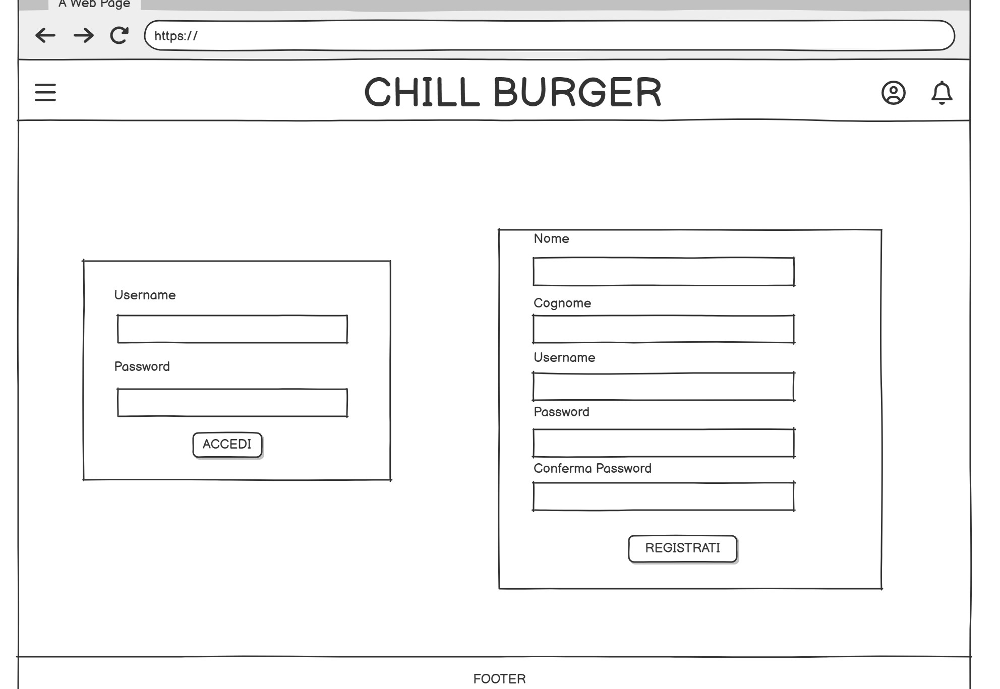 | 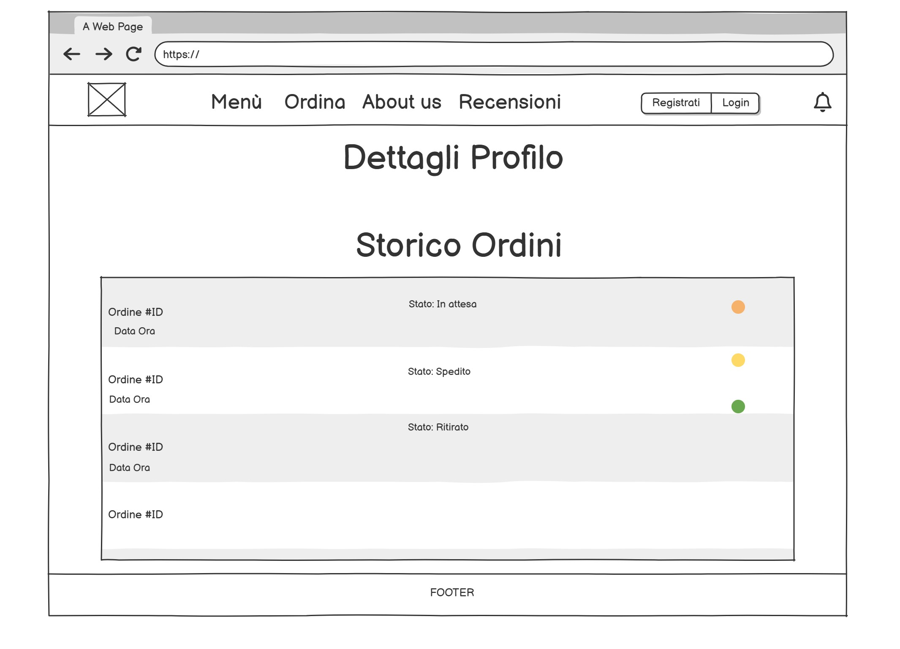 | 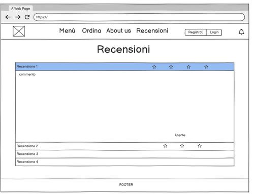 |

| Checkout | Notifications | Manager Dashboard |
|:--------:|:-------------:|:-----------------:|
| 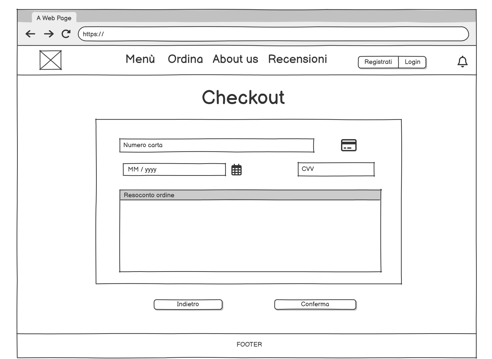 | 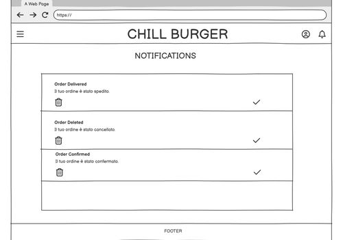 | 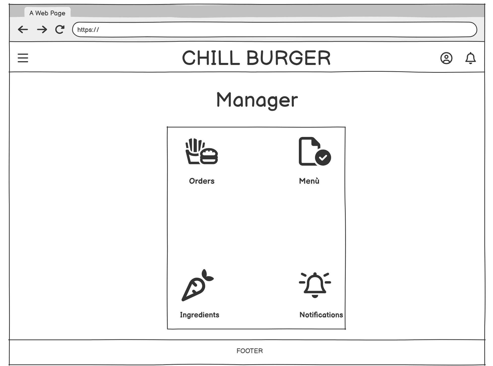 |

</details>

<details>
<summary><strong>📱 Mobile Views</strong> (click to expand)</summary>
<br/>

| Homepage | Menu | Order Now |
|:--------:|:----:|:---------:|
| 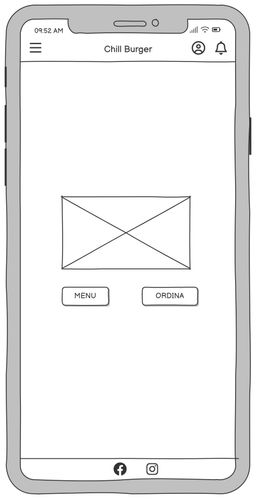 | 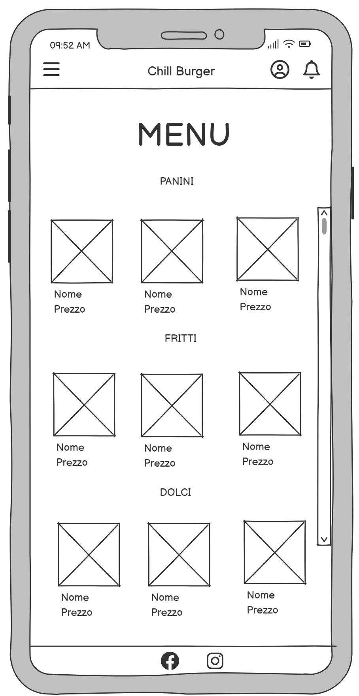 | 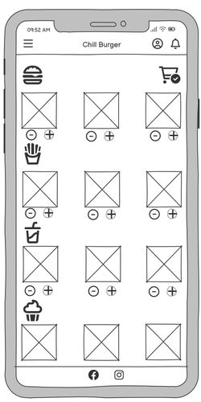 |

| Login | Profile | Reviews |
|:-----:|:-------:|:-------:|
| 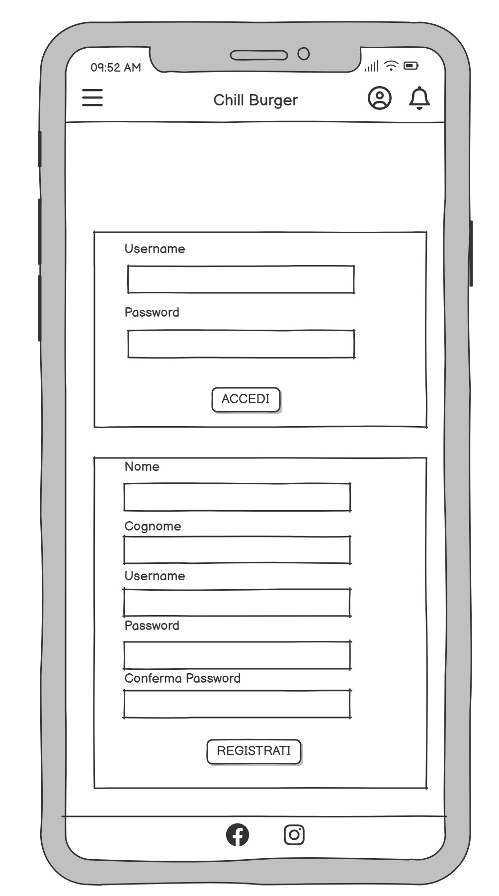 | 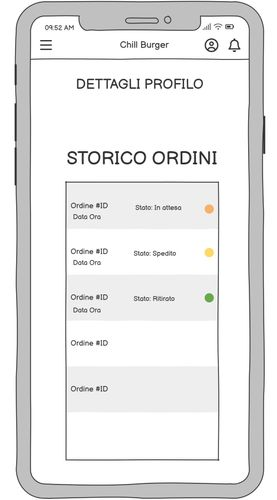 | 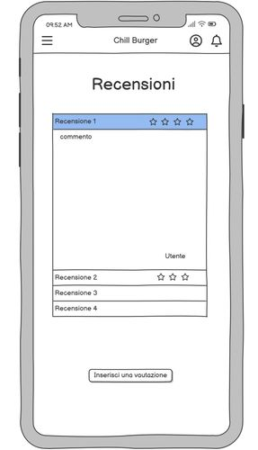 |

</details>

---

## 🤝 Contributing

Contributions are welcome! If you'd like to contribute:

1. 🍴 **Fork** the repository
2. 🌿 **Create** a feature branch (`git checkout -b feature/amazing-feature`)
3. 💾 **Commit** your changes (`git commit -m 'Add amazing feature'`)
4. 📤 **Push** to the branch (`git push origin feature/amazing-feature`)
5. 🔁 **Open** a Pull Request

---

## 📝 License

This project is licensed under the **MIT License** — see the [LICENSE](LICENSE) file for details.

---

## 👥 Authors

- **Daniel Ariyo** - [@DanAriyo](https://github.com/DanAriyo)
- **Riccardo Balzani** — [@FrittatinaDiBucatini09](https://github.com/FrittatinaDiBucatini09)
- **Filippo Ferretti** - [@Filoferro03](https://github.com/Filoferro03)


---

<p align="center">
  Made with ❤️ and 🍔 at the <strong>University of Bologna</strong>
</p>
